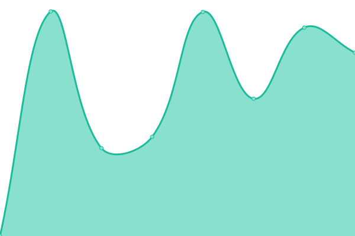
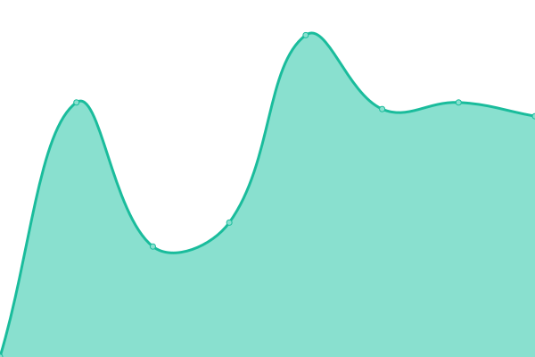

# [📈 Live Status](https://phante.github.io/prdi-status): <!--live status--> **🟩 All systems operational**

This repository contains the open-source uptime monitor and status page for [Elvis Del Tedesco](https://www.phante.com), powered by [Upptime](https://github.com/upptime/upptime).

With [Upptime](https://upptime.js.org), you can get your own unlimited and free uptime monitor and status page, powered entirely by a GitHub repository. We use [Issues](https://github.com/phante/prdi-status/issues) as incident reports, [Actions](https://github.com/phante/prdi-status/actions) as uptime monitors, and [Pages](https://phante.github.io/prdi-status) for the status page.

<!--start: status pages-->
<!-- This summary is generated by Upptime (https://github.com/upptime/upptime) -->
<!-- Do not edit this manually, your changes will be overwritten -->
<!-- prettier-ignore -->
| URL | Status | History | Response Time | Uptime |
| --- | ------ | ------- | ------------- | ------ |
|  [progettodighe](https://www.progettodighe.it) | 🟩 Up | [progettodighe.yml](https://github.com/phante/prdi-status/commits/HEAD/history/progettodighe.yml) | 

 2652ms
     
 | 

<a href="https://status.prdi.it/history/progettodighe">100.00%</a>
    

|  [umami.progettodighe](https://umami.progettodighe.it) | 🟩 Up | [umami-progettodighe.yml](https://github.com/phante/prdi-status/commits/HEAD/history/umami-progettodighe.yml) | 

 1306ms
     
 | 

<a href="https://status.prdi.it/history/umami-progettodighe">100.00%</a>
    

|  [vajont.eu](https://vajont.eu) | 🟩 Up | [vajont-eu.yml](https://github.com/phante/prdi-status/commits/HEAD/history/vajont-eu.yml) | 

 1164ms
     
 | 

<a href="https://status.prdi.it/history/vajont-eu">100.00%</a>
    

<!--end: status pages-->

[**Visit our status website →**](https://phante.github.io/prdi-status)

## 📄 License

- Powered by: [Upptime](https://github.com/upptime/upptime)
- Code: [MIT](./LICENSE) © [Elvis Del Tedesco](https://www.phante.com)
- Data in the `./history` directory: [Open Database License](https://opendatacommons.org/licenses/odbl/1-0/)
